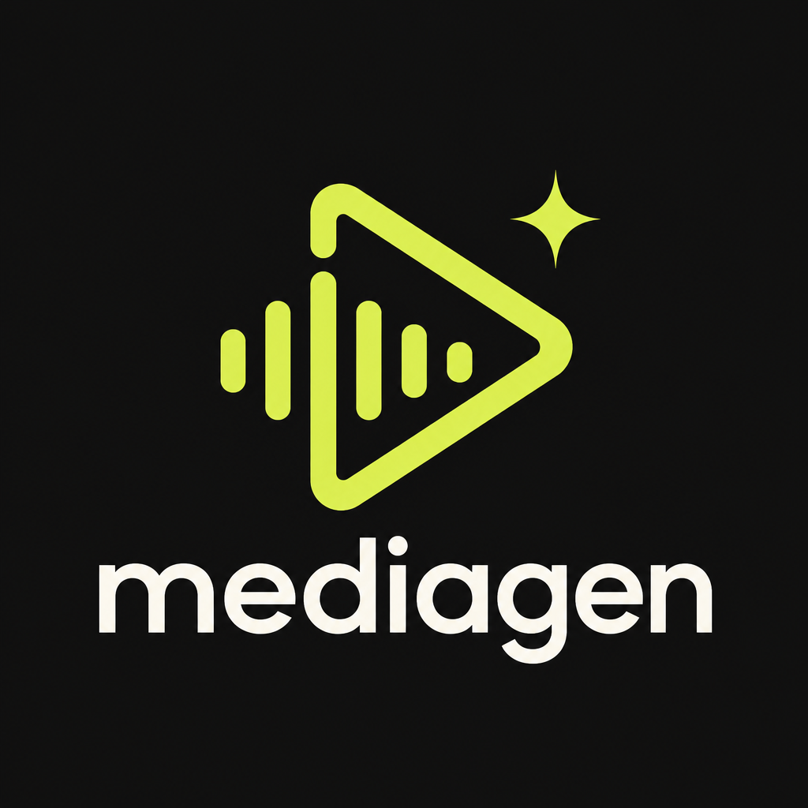
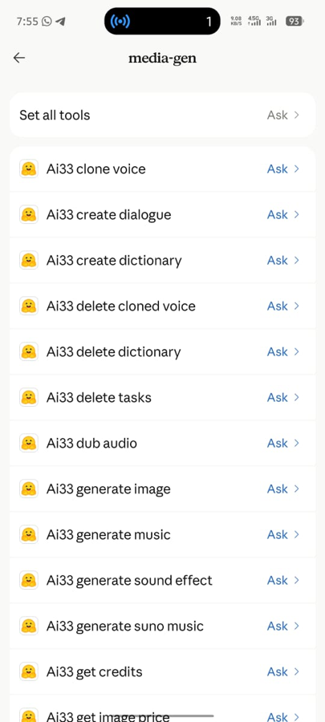
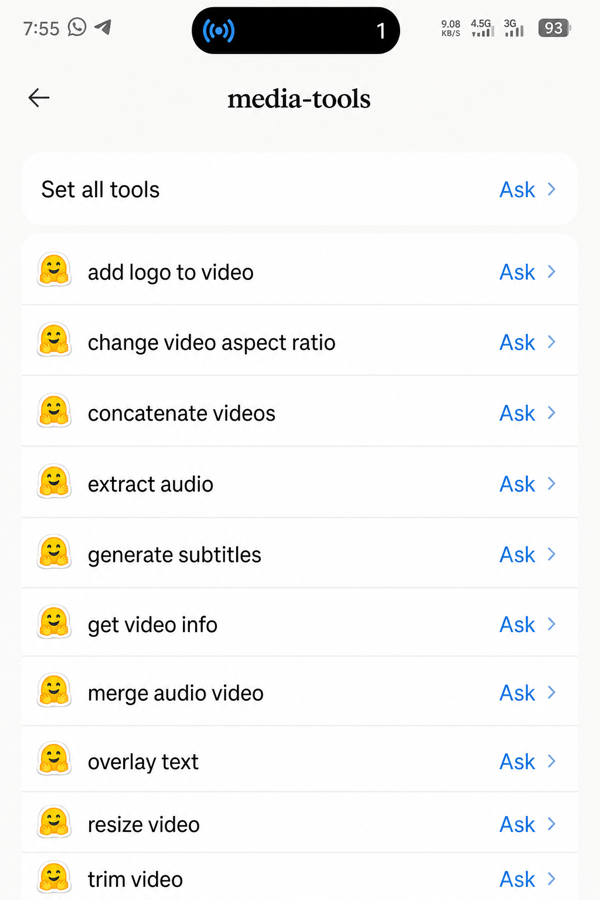

# mediagen

<p align="center">
  
</p>

A media and content MCP for busy 9-to-5 people. Connect it once in Claude, then make voice, music, images, and YouTube research from your phone without opening five other sites.

This is not a generic skill. It is a live tool server. You ask. The tools run. You keep moving.

<p align="center">
  
  &nbsp;&nbsp;
  
</p>

<p align="center"><em>On your phone: open Claude, pick a tool, tap Ask. No extra site.</em></p>

**MCP URL:** `https://pima5-ai33-mcp.hf.space/mcp`

## Who it helps

Creators who ship after work, on the commute, or between Slack pings, and do not have time to bounce between AI33, YouTube Studio, editors, and download tabs.

If Claude is already open on your phone, that is enough.

## What you can do

- Generate speech, dialogue, clones, dubs, SFX, music, and images
- Research niches live on YouTube (saturation, outliers, rising channels)
- Stay in one chat instead of multitasking across dashboards

## Add it to Claude (2 minutes)

### Claude.ai / Claude desktop

1. Open [Settings → Connectors](https://claude.ai/settings/connectors)
2. **Add custom connector**
3. Name: `mediagen`
4. URL: `https://pima5-ai33-mcp.hf.space/mcp`
5. Save, then enable it in a chat from the tools menu

This Space already has the AI33 key set as a secret, so you usually do not paste a key.

### Claude Code

```bash
claude mcp add --transport http mediagen https://pima5-ai33-mcp.hf.space/mcp
```

### Other MCP clients

```json
{
  "mcpServers": {
    "mediagen": {
      "type": "http",
      "url": "https://pima5-ai33-mcp.hf.space/mcp",
      "headers": {
        "xi-api-key": "YOUR_AI33_API_KEY",
        "x-youtube-api-key": "YOUR_YOUTUBE_API_KEY"
      }
    }
  }
}
```

Headers are optional when those keys are Space secrets. For file inputs (voice samples, audio, reference images), use public URLs.

## Why this beats a normal skill

A skill is a prompt. mediagen is a live tool server:

- Real AI33 Pro media jobs with downloadable outputs
- Real YouTube Data API numbers (no invented view counts)
- Works over streamable HTTP so Claude on mobile can call it like any other connector

You are not remembering steps. You press Ask and get assets or research back.

## Run your own

Python 3.12+, an [AI33](https://ai33.pro) key, optional free [YouTube Data API v3](https://console.cloud.google.com/) key.

```bash
pip install -r requirements.txt
export AI33_API_KEY="your-key"
export YOUTUBE_API_KEY="your-youtube-key"   # optional
python server.py
# http://localhost:7860/mcp
```

```bash
docker build -t mediagen .
docker run --rm -p 7860:7860 -e AI33_API_KEY=your-key mediagen
```

| Key | For |
|---|---|
| `AI33_API_KEY` / `xi-api-key` | Media generation |
| `YOUTUBE_API_KEY` / `x-youtube-api-key` | YouTube research |
| `PORT` | Default `7860` |

## Tool map

**Media:** voices, TTS, dialogue, clone, STT, dubbing, voice change/isolate, SFX, MiniMax + Suno music, images, pronunciation dictionaries, tasks.

**YouTube research:** `youtube_search`, `youtube_scan_niche`, `youtube_channel_outliers`, `youtube_video_context`, `youtube_rising_channels`.

## Host a copy

1. [Duplicate the Space](https://huggingface.co/spaces/pima5/ai33-mcp?duplicate=true)
2. Add `AI33_API_KEY` (+ optional `YOUTUBE_API_KEY`)
3. Point Claude at `https://<user>-<space>.hf.space/mcp`

## Stuck?

- **401 on media:** check the AI33 key / `ai33_get_credits`
- **YouTube key missing:** set `YOUTUBE_API_KEY` or send `x-youtube-api-key`
- **503:** Space is paused; open it and Restart
- **Browser 406 on `/mcp`:** use Claude, not the address bar
